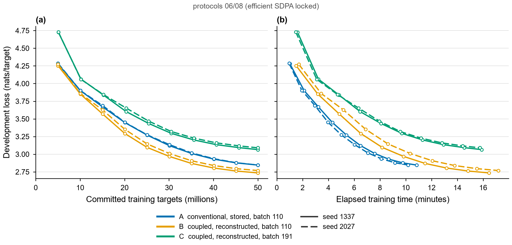
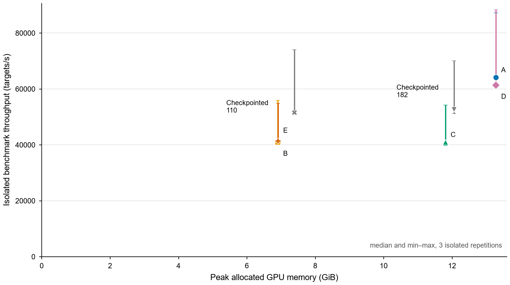

# Reversible training of a 20M-parameter LLM

Built as ERA V5 Session 13 assignment.

**The question.** Train a ~20M-parameter LLM for 50M tokens at a fixed batch size that runs. Train it again with a reversible architecture, compare reversible variants (Euler, midpoint, ...), and then train at the largest batch the reversible version allows. Report final loss, speed (tokens/s), peak memory and other findings.

## Answer in brief

| Question | Answer |
|---|---|
| Model | 19,969,152 parameters (9 layers, width 384, 6 heads, context 512, vocabulary 10,000) |
| Training budget | Exactly 50,000,000 next-token targets per run, TinyStories, Kaggle Tesla T4 |
| Fixed batch size | **110 sequences x 512 tokens**, the largest batch the conventional model fits on the T4 (111 runs out of memory) |
| Reversible variant that worked best | **Coupled (two-stream) Euler**, step size 0.5. It beat midpoint in the 2M-token pilots and in a full 50M-token run, though the full-run gap is about the size of seed-to-seed variation |
| Effect of reversibility at the same batch | **48% lower peak memory** (13.28 to 6.91 GiB), the same loss as the non-reconstructed version of the same model, and **34% lower throughput** |
| Maximum reversible batch | **191 sequences** (192 runs out of memory), 74% more than the conventional limit of 110 |
| Did the bigger batch help? | **No.** With the same learning-rate recipe and the same 50M tokens, batch 191 ended at a clearly worse loss (3.07 vs 2.74) and was not faster |

## Main results

All rows are full 50M-token runs with seed 1337 on a Tesla T4 with FP16 autocast. Loss is in nats per token.

| Run | What it is | Batch | Updates | Final train loss (last 1M tokens) | Holdout loss | Tokens/s | Peak memory allocated | Peak memory reserved |
|---|---|---:|---:|---:|---:|---:|---:|---:|
| [A](experiments/kaggle-locked-v1/runs/A-L-1337/final.json) | Conventional baseline | 110 | 888 | 2.770 | 2.855 | 76,891 | 13.28 GiB | 14.34 GiB |
| [D](experiments/kaggle-locked-v1/runs/D-L-1337/final.json) | Coupled Euler, activations stored (control) | 110 | 888 | 2.661 | 2.744 | 76,460 | 13.29 GiB | 14.38 GiB |
| [B](experiments/kaggle-locked-v1/runs/B-L-1337/final.json) | **Coupled Euler, reversible backward** | 110 | 888 | 2.660 | **2.743** | 50,653 | **6.91 GiB** | 8.34 GiB |
| [F](experiments/kaggle-supplemental-v1/runs/F-midpoint-1337/final.json) | Midpoint, reversible backward | 110 | 888 | 2.693 | 2.775 | 45,136 | 6.83 GiB | 8.50 GiB |
| [C](experiments/kaggle-locked-repair-v1/runs/C-L191-1337/final.json) | **Coupled Euler, reversible, maximum batch** | 191 | 512 | 2.994 | 3.072 | 52,476 | 11.81 GiB | 14.37 GiB |
| [E](experiments/kaggle-locked-repair-v1/runs/E-L191-1337/final.json) | Coupled Euler, reversible, batch 110 accumulated to 191 (control) | 110 (effective 191) | 512 | 2.995 | 3.072 | 49,910 | 6.91 GiB | 8.33 GiB |

Run IDs in the repository carry suffixes: A, B and D are `A-L-1337`, `B-L-1337`, `D-L-1337`; C and E are `C-L191-1337`, `E-L191-1337`; F is `F-midpoint-1337`.

Run F comes from an earlier campaign that left PyTorch's attention backend on automatic selection, while the other rows pin the memory-efficient backend. Its like-for-like Euler partner from that same campaign is [B-1337](experiments/kaggle-full-v1/runs/B-1337/final.json): holdout 2.751, 54,644 tokens/s, 6.91 GiB.

A second seed (2027) repeats the pattern: holdout 2.853 for A, 2.774 for B and 3.096 for C at batch 191. Every run is listed in [results/runs.csv](results/runs.csv).



## Step 1: fixing the batch size

A batch-size search on the T4 (20 warm-up updates, three fresh-process confirmations and one 200-update sustained trial at each limit) found these largest stable batches:

| Model and backward pass | Largest stable batch | First batch that ran out of memory |
|---|---:|---:|
| Conventional, stored activations | 110 | 111 |
| Conventional, gradient checkpointing | 182 | 183 |
| Coupled Euler, stored activations | 110 | 111 |
| Coupled Euler, reversible backward | **191** | 192 |

The fixed batch for the comparison is therefore 110 x 512 = 56,320 tokens per update, giving 888 updates for 50M tokens. Raw search logs are in [experiments/kaggle-locked-batch-v1](experiments/kaggle-locked-batch-v1).

## Step 2: reversible training at the same batch

### Which variant: Euler or midpoint

Three formulations were implemented with a memory-saving reversible backward pass:

- **Coupled Euler.** Two streams `u` and `v` start as copies of the embedding. Each block does `u = u + h*Attention(v)` and then `v = v + h*MLP(u)`. The inverse subtracts the same terms in the opposite order. The mean of the two streams goes to the output head.
- **Midpoint (leapfrog).** `p[l+1] = p[l-1] + 2h*F(p[l])`, started with one Euler half-step. The inverse is `p[l-1] = p[l+1] - 2h*F(p[l])`.
- **Blended midpoint.** Midpoint with a weighted mix of the two previous states (`a = 0.5`).

A plain single-stream residual block `x + F(x)` has no exact inverse, so it is used only as the conventional baseline.

**Pilot comparison** (2M tokens each, batch 4, 977 updates, development loss):

| Variant | Step 0.25 | Step 0.5 | Step 1.0 |
|---|---:|---:|---:|
| Coupled Euler | 3.940 | **3.915** | 3.927 |
| Midpoint | 3.963 | 3.963 | 3.973 |
| Blended midpoint | 3.967 | n/a | n/a |
| Conventional (reference) | 3.954 | | |

Coupled Euler was best at every step size, so coupled Euler with `h = 0.5` was chosen for the main runs.

**Full 50M-token check** (same batch 110, same seed, same campaign): coupled Euler reached holdout 2.751 and midpoint 2.775. Midpoint was also 17% slower (45,136 vs 54,644 tokens/s) with about the same memory.

Caveat: the 0.024 gap in the full runs is a single-seed result, and coupled Euler's own seeds differ by a similar amount (2.743 vs 2.774). The evidence says coupled Euler is at least as good as midpoint and faster; it does not prove a large quality advantage.

### What reversibility cost and saved

Comparing B with D isolates the reversible backward pass, because both use the identical coupled Euler model:

- **Memory:** 13.29 GiB to 6.91 GiB peak allocated, a 48% reduction.
- **Loss:** 2.744 to 2.743 holdout. Reconstructing activations instead of storing them did not change the result.
- **Speed:** 76,460 to 50,653 tokens/s, 34% slower, because every block is recomputed during the backward pass.

Comparing D with A shows the coupled Euler architecture itself gave a lower loss than the conventional model (2.744 vs 2.855) at the same speed and memory. So the loss improvement of B over the baseline comes from the architecture, and the memory saving comes from the reversible backward pass.

Gradient checkpointing on the conventional model is a useful reference point: 7.39 GiB and 60,880 tokens/s with the baseline's loss (run `G-checkpointed-1337`).



## Step 3: reversible training at the maximum batch

Run C trains the chosen coupled Euler model at batch 191, the largest that fits. A first attempt at 192 (the limit found with the automatic attention backend) ran out of memory on its third update and is kept as a [failed run](experiments/kaggle-locked-v1/runs/C-L-1337); the search was repeated and 191 was used.

Findings:

- **Loss got worse**: holdout 3.072 against 2.743 at batch 110. Both runs see the same 50M tokens, but batch 191 makes only 512 optimizer updates instead of 888, and the learning rate and schedule were deliberately left unchanged.
- **The cause is the effective batch, not the hardware batch.** Control run E uses batch 110 with gradient accumulation to an effective 191 and lands on the same loss (3.072). Retuning the learning rate for the larger batch was not tested.
- **No speed-up.** 52,476 tokens/s at batch 191 against 50,653 at batch 110 in the training runs; the isolated benchmark below shows no difference. The T4 was already saturated at batch 110.
- **Memory** rises to 11.81 GiB allocated and 14.37 GiB reserved, which is the card's limit.

For a fixed token budget on this GPU, the practical value of reversibility is the halved memory at the original batch, not the larger batch it permits.

## Isolated speed benchmark

The training runs above shared a two-GPU Kaggle session, so speed was measured again one process at a time (three repetitions, 20 warm-up and 100 measured updates each):

| Condition | Median tokens/s | Range |
|---|---:|---:|
| A conventional, batch 110 | 64,088 | 61,678 to 87,205 |
| D coupled Euler stored, batch 110 | 61,347 | 61,222 to 88,268 |
| B coupled Euler reversible, batch 110 | 40,950 | 39,992 to 55,974 |
| C coupled Euler reversible, batch 191 | 40,951 | 39,764 to 54,228 |

One of the two T4s was consistently faster than the other, which explains the wide ranges. Within the same GPU, the reversible backward pass was 33 to 37% slower than stored activations, and batch 191 was within 1 to 3% of batch 110. Raw files are in [experiments/kaggle-benchmark-v2](experiments/kaggle-benchmark-v2/benchmark).

## Model and training setup

| Item | Value |
|---|---|
| Parameters | 19,969,152 for every variant (the second stream adds no weights) |
| Architecture | Decoder-only, 9 blocks, width 384, 6 heads, GELU MLP width 1,536, pre-LayerNorm, learned positions, tied input/output embeddings, no biases, no dropout |
| Context / vocabulary | 512 tokens / 10,000 byte-level BPE |
| Data | TinyStories (revision `f54c09fd`), tokenizer trained on the first 100,000 training stories, duplicates and train/eval overlaps removed |
| Evaluation | Development split of 262,144 tokens every 5M tokens; final holdout split of 1,000,000 tokens |
| Optimizer | AdamW, lr 3e-4, betas (0.9, 0.95), weight decay 0.1 on weight matrices, gradient clipping at 1.0 |
| Schedule | Linear warm-up over 1M tokens, cosine decay to 3e-5 at 50M tokens |
| Precision | FP16 autocast with GradScaler; parameters and optimizer state in FP32 |
| Hardware / software | Kaggle Tesla T4, PyTorch 2.10.0+cu128, no `torch.compile`, one GPU per run |

All runs read the same ordered 50M-token stream; seeds change only the initialization. "Tokens/s" is 50M divided by the summed time of the training updates and excludes evaluation and checkpointing. "Peak memory" is `torch.cuda.max_memory_allocated()` and `max_memory_reserved()` over training.

**Reversible backward pass.** [src/revllm/model.py](src/revllm/model.py) implements it as a custom `torch.autograd.Function`. The forward pass runs without building a graph and keeps only the input and the final states. The backward pass walks the blocks in reverse: it reconstructs each block's input from its output, recomputes that single block with gradients enabled, and backpropagates through it. The embedding, final normalization, output head and loss are ordinary autograd and are included in the memory figures, which is why memory halves rather than becoming independent of batch size.

**Correctness checks.** Unit tests compare reversible gradients against ordinary autograd (43 tests pass, [audit/pytest.txt](audit/pytest.txt)). On the trained checkpoints under the FP16 training settings, the largest relative gradient error was 5.1e-4 and the largest reconstruction error 1.7e-5.

## Repository guide

| Path | Contents |
|---|---|
| [notebooks/](notebooks) | `00_setup_and_correctness`, `01_baseline`, `02_reversible_variants`, `03_maximum_batch`, `04_results_and_audit` |
| [src/revllm/](src/revllm) | Model, reversible backward pass, training loop, data preparation, evaluation |
| [configs/](configs) | Exact configuration of every run |
| [experiments/](experiments) | Raw Kaggle outputs: per-update `metrics.jsonl`, `eval.jsonl`, `final.json`, logs |
| [results/](results) | Aggregated tables (`runs.csv`, `causal_comparisons.csv`) and figures |
| [REPORT.md](REPORT.md) | Longer technical report ([PDF](REPORT.pdf)) |
| [protocols/](protocols) | Decision records written before and during the experiments |
| [audit/](audit) | Evidence ledger (26 checks, all PASS), test log, parameter counts, notebook execution and report-export hashes |
| [docs/diagrams/](docs/diagrams) | Architecture, reversible forward/inverse, activation storage and experiment-design diagrams (`scripts/build_beginner_diagrams.py`) |
| [scripts/](scripts) | Analysis, report, figure and audit scripts, plus the Kaggle job staging scripts used to run the experiments |

**About the notebooks.** The 50M-token runs were executed as Kaggle GPU script jobs using the code in `src/revllm`, not inside the notebooks. The notebooks are executed and saved with outputs: each runs a small real training demonstration through the same code, then loads the raw Kaggle logs, checks that every run's per-update records sum to exactly 50,000,000 tokens, and prints or plots the results shown here.

## Reproduce

```powershell
python -m pip install -e '.[test,report]'
python -m pytest -q tests
python -m revllm.cli prepare --out data
python scripts/reproduce_run.py --run A-L-1337 --data-dir data --out experiments/reproduction/A-L-1337
python scripts/reproduce_run.py --run B-L-1337 --data-dir data --out experiments/reproduction/B-L-1337
python scripts/reproduce_run.py --run C-L191-1337 --data-dir data --out experiments/reproduction/C-L191-1337
python scripts/analyze.py
python scripts/report_figures.py
```

Each full run needs a CUDA GPU with about 15 GiB of memory and takes 11 to 19 minutes on a T4. Add `--resume` to continue an interrupted run. Model checkpoints (about 240 MB each) are not stored in Git; their SHA-256 hashes are recorded in each `final.json`.

## Limitations

- Results are for one small model, one dataset and one training recipe. Two seeds for the main conditions and one seed for midpoint give a description of variation, not statistical confidence.
- The learning rate was not retuned for batch 191, so the worse loss at maximum batch is a statement about this fixed recipe.
- The coupled Euler architecture differs from the conventional model in more than one way (two streams, different normalization inputs, stream averaging), so its loss advantage is not attributed to a single cause.
- Batch-size limits depend on this GPU, PyTorch version and allocator, and moved by one sequence (192 to 191) when the attention backend was pinned.
- An earlier campaign of the same runs used automatic attention-backend selection. It is kept unchanged under `experiments/kaggle-full-v1` and gives the same conclusions; the tables above use the pinned-backend runs except where stated.

## References

- Gal et al., *Reversing Large Language Models for Efficient Training and Fine-Tuning* (2025), [arXiv:2512.02056](https://arxiv.org/abs/2512.02056).
- [TinyStories dataset](https://huggingface.co/datasets/roneneldan/TinyStories), CDLA-Sharing-1.0.
- Design references: [nanoGPT](https://github.com/karpathy/nanoGPT), [build-nanogpt](https://github.com/karpathy/build-nanogpt), [nanochat](https://github.com/karpathy/nanochat). Full source list in [literature/sources.md](literature/sources.md).
