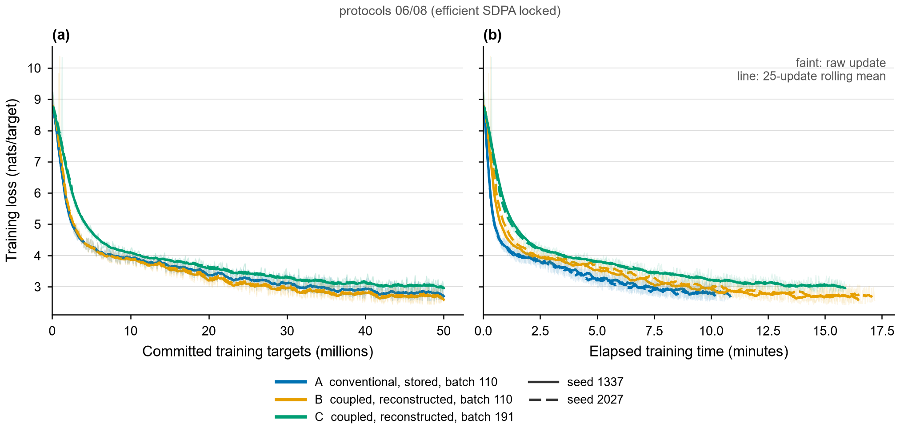
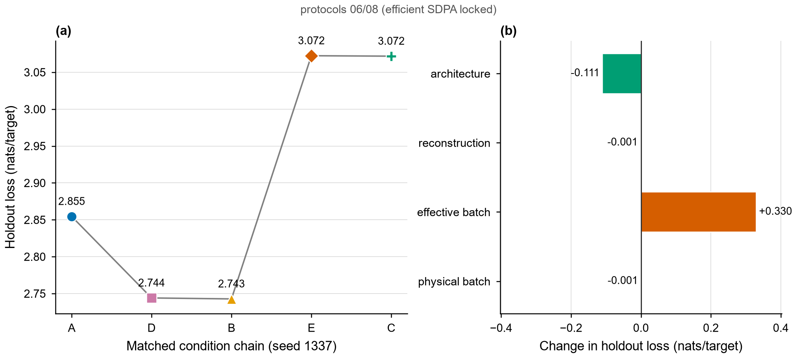
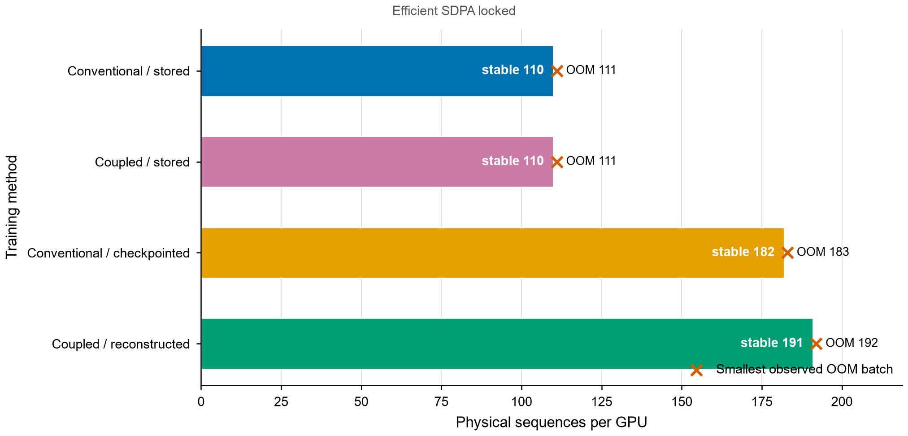
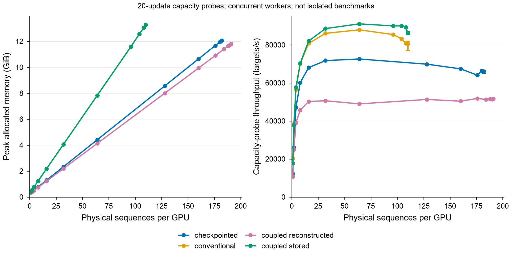
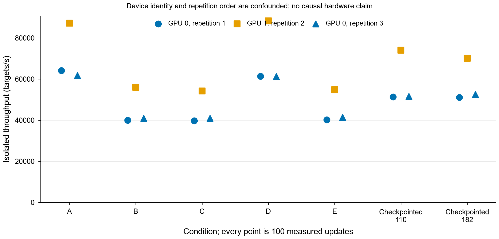
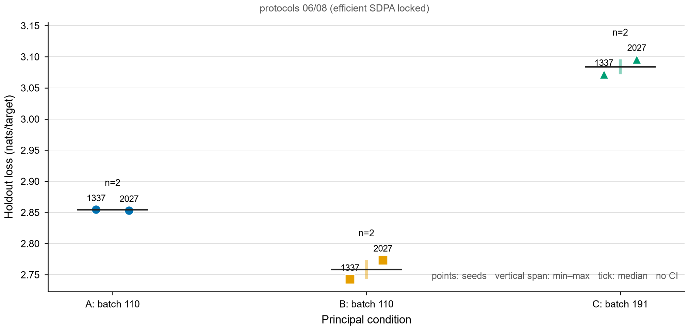
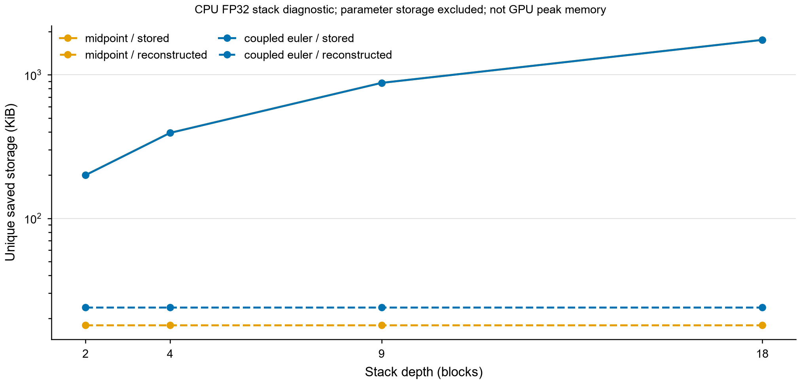
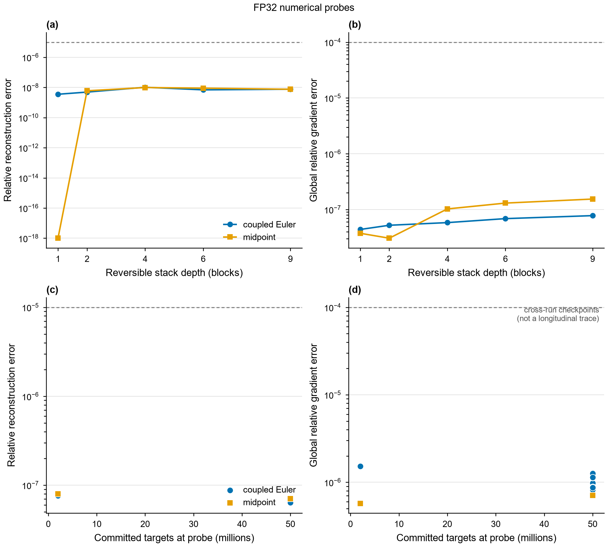

# Reversible LLM training: memory saved, compute spent

Every check in the evidence ledger ([audit/ledger.md](audit/ledger.md)) passes.

## What the experiment answers

Reconstruction saved **48.0%** of peak allocated memory at the common batch, with **33.8% lower campaign throughput** than stored autograd using the same reversible equations (seed 1337, explicitly locked efficient SDPA). Increasing effective batch from 110 to 191 worsened holdout loss by **0.330 nats/target** under the fixed recipe. More capacity did not automatically improve training.

This report is generated by `scripts/build_report.py` from raw-log-verified summaries. The selected table uses **explicitly locked efficient SDPA**, with 8 runs, each at 50M targets. Across retained full-budget campaigns, 21 runs account for 1,050,000,000 committed targets; this cumulative total is not one model's training budget.

## Controls

| Condition | Architecture / backward | Physical batch | Effective batch | Interpretation |
|---|---|---:|---:|---|
| A | Conventional / stored | 110 | 110 | Baseline |
| D | Coupled Euler / stored | 110 | 110 | A to D changes architecture |
| B | Coupled Euler / reconstruction | 110 | 110 | D to B changes backward implementation |
| E | Coupled Euler / reconstruction | 110, then 81 | 191 | B to E changes effective batch |
| C | Coupled Euler / reconstruction | 191 | 191 | E to C changes physical batching |


## Model, equations and recipe

All main models have **19,969,152 unique trainable parameters**: 9 blocks, width 384, 6 heads of width 64, GELU FFN width 1,536, context 512 and vocabulary 10,000. They use bias-free pre-LayerNorm, learned positions, tied token/output weights, no linear biases and no dropout. Duplicating a residual state adds no learned weights.

The conventional block is `x + F(x)`, where `F(x) = A(x) + M(x + A(x))`. Midpoint uses an Euler bootstrap `p1 = p0 + 0.5*h*F0(p0)` and eight steps `p[l+1] = p[l-1] + 2*h*F[l](p[l])`. Its inverse subtracts the recomputed increment. Blended midpoint adds coefficients `a` and `1-a` to the two predecessor states; the course-related diagnostic uses `a=0.5, h=0.25`. Coupled Euler uses `u' = u + h*A(v)` followed by `v' = v + h*M(u')`, then reverses these operations in the opposite order. Its two initial streams equal the embedding; their final mean feeds the shared normalization and output head. Arbitrary attention/MLP functions are not assumed to conserve Hamiltonian energy.

Whole-stack custom autograd retains boundary states and reconstructs hidden activations one block at a time. Embeddings, midpoint bootstrap, final normalization/head and transient workspace remain in memory accounting. Stored and reconstructed implementations use identical forward equations; ordinary residual Euler is not given an invalid subtraction-at-output inverse.

AdamW uses learning rate 3e-4, betas (0.9,0.95), epsilon 1e-8, and weight decay 0.1 on linear matrices, excluding embeddings and norm scales. After token-normalized accumulation, gradients are unscaled and clipped to norm 1. The schedule warms up for 1M targets and decays by cosine to 3e-5 at 50M. Parameters, optimizer state, residual states and reconstruction arithmetic stay FP32; suitable operations use FP16 autocast and GradScaler on T4. Compilation is disabled. Each worker is a separate single-GPU model with world_size=1; two workers are not distributed training.


## Data and exact accounting

TinyStories is pinned at revision `f54c09fd23315a6f9c86f9dc80f725de7d8f9c64`. A byte-level BPE tokenizer is trained on the first 100,000 unique training documents only. Exact normalized-text duplicates and train/evaluation overlaps are removed. Official validation documents are deterministically hash-partitioned into development (262,144 targets) and final holdout (1,000,000 targets). Training consumes the identical ordered 50M-target stream across runs; seeds vary initialization. End-of-document tokens are counted as targets, and causal attention continues across packed story boundaries.

Every completed run commits exactly 50,000,000 non-padding next-token targets. Padding is masked; the final partial batch is normalized by its actual target count. AMP-skipped updates replay the same data without advancing the committed cursor or schedule. Attempted targets, successful targets, retries, padding and separators are logged separately. Pilots, validation, demonstrations and benchmarks do not contribute to assignment training totals. The first 131,072 training targets form the fixed training-subset evaluation; this subset and the held-out split need not have identical difficulty.


## Selection before confirmation

Eight equal 2M-target pilots investigated conventional, midpoint at h=0.25/0.5/1.0, coupled Euler at the same steps, and blended midpoint at a=0.5,h=0.25. Initial mixed-precision and trained FP32 numerical gates passed. Coupled Euler h=0.5 was selected by the frozen rule: development loss 3.915341 versus midpoint h=0.5 at 3.963086. Full runs restarted from initialization; pilot targets do not count toward them. All candidate results and failures are retained.

## Full-budget results

| Run | Physical / effective batch | Holdout loss | Perplexity | Updates | Training targets/s | Allocated GiB |
|---|---:|---:|---:|---:|---:|---:|
| [A-L-1337](experiments/kaggle-locked-v1/runs/A-L-1337/final.json) | 110 / 110 | 2.8546 | 17.367 | 888 | 76,891 | 13.284 |
| [B-L-1337](experiments/kaggle-locked-v1/runs/B-L-1337/final.json) | 110 / 110 | 2.7427 | 15.529 | 888 | 50,653 | 6.909 |
| [C-L191-1337](experiments/kaggle-locked-repair-v1/runs/C-L191-1337/final.json) | 191 / 191 | 3.0718 | 21.580 | 512 | 52,476 | 11.807 |
| [D-L-1337](experiments/kaggle-locked-v1/runs/D-L-1337/final.json) | 110 / 110 | 2.7440 | 15.550 | 888 | 76,460 | 13.285 |
| [E-L191-1337](experiments/kaggle-locked-repair-v1/runs/E-L191-1337/final.json) | 110 / 191 | 3.0724 | 21.593 | 512 | 49,910 | 6.909 |
| [A-L-2027](experiments/kaggle-locked-repair-v1/runs/A-L-2027/final.json) | 110 / 110 | 2.8534 | 17.346 | 888 | 81,848 | 13.284 |
| [B-L-2027](experiments/kaggle-locked-repair-v1/runs/B-L-2027/final.json) | 110 / 110 | 2.7737 | 16.017 | 888 | 48,501 | 6.909 |
| [C-L191-2027](experiments/kaggle-locked-repair-v1/runs/C-L191-2027/final.json) | 191 / 191 | 3.0959 | 22.108 | 512 | 52,886 | 11.807 |

All losses are nats per next-token target; perplexity is exp(loss). Throughput here is campaign throughput, not the isolated benchmark. Allocated memory includes optimizer state. Exact values, reserved memory, final-update loss, last-1M target-weighted loss, fixed-training-subset loss, padding, separators and hashes are in [runs.csv](results/runs.csv).


Individual seed curves are shown without smoothing of development evaluations. Time is accumulated training-update time. The training-only graph below overlays a 25-update centered rolling mean on faint raw updates; endpoints are padded with their boundary values. It is a visualization, not additional observations.



## What changes caused which result?

For seed 1337, A to D changes holdout loss by **-0.110533** nats/target. The stored reversible architecture already obtains the loss improvement; it cannot be attributed to reconstruction. D to B changes loss by **-0.001294**, saves **48.00%** of allocated memory, and reduces campaign throughput by **33.75%**. This is the direct memory/recomputation trade-off.

B to E raises loss by **+0.329650** nats/target when effective batch increases. E to C changes loss by only **-0.000605** at matched effective batch. The large quality difference therefore follows the effective-batch change in this comparison rather than the choice between physical and accumulated batching. Updates decrease from **888** to **512** at the same token budget; this is consistent with an optimization explanation, but does not establish its detailed mechanism.



The contrast panel uses one seed for D/E; its small differences are not significance tests. A versus C changes architecture, backward implementation and batch together and is interpreted only as a combined practical outcome.

## Memory capacity and performance

Original automatic-dispatch batch searches observed stable/OOM pairs 110/111 (conventional stored), 181/182 (conventional checkpointed), 110/111 (coupled stored), and 192/193 (coupled reconstructed). Each boundary passed three fresh 20-update confirmations and a sustained 200-update test. The reconstructed capacity is 74.5% higher than conventional stored under that search environment. These original OOM measurements are not silently relabeled as new locked-backend searches. Locked efficient-SDPA searches measured 110/111, 182/183, 110/111 and 191/192 respectively. The 192-batch locked training attempt failed on its third update; protocol 08 retains this failure and uses new 191-batch C/E identities. The capacity gain under the locked search is 73.6%. The one-sequence differences are not attributed solely to the backend.





These capacity-search curves show successful 20-update probes. Throughput ranges reflect repeated trials where available; points with one trial do not estimate variability. They are not the isolated benchmark.

| Condition | Median targets/s | Observed min–max | Allocated / reserved GiB |
|---|---:|---:|---:|
| A | 64,088 | 61,678–87,205 | 13.283 / 14.340 |
| B | 40,950 | 39,992–55,974 | 6.909 / 8.328 |
| C | 40,951 | 39,764–54,228 | 11.807 / 14.357 |
| D | 61,347 | 61,222–88,268 | 13.285 / 14.381 |
| E | 41,356 | 40,250–54,838 | 6.909 / 8.334 |
| checkpointed-B0 | 51,543 | 51,328–73,996 | 7.394 / 8.977 |
| checkpointed-max | 52,578 | 51,144–70,074 | 12.064 / 12.689 |

Each condition uses 20 successful warmup updates and 100 measured updates in each of three fresh processes. Device assignments are 0,1,0 and one worker runs at a time. Rates divide committed measured targets by synchronized elapsed time; bars show the complete observed repetition range. Synthetic-token optimization is a performance probe, not a language-quality result.

The GPU-1 repetition is faster than both GPU-0 repetitions for every condition. Device identity and repetition order are confounded; these observations do not prove hardware throttling. Comparing matching assignments/repetition indices, reconstruction reduces throughput by 33.1–36.6% (D to B). The physical/accumulated throughput ratio is 0.988–0.990 (E to C), so larger physical batching provides no observed speedup here. [Generated comparisons](results/benchmark_comparisons.csv) retain each ratio.




## Seed variation and additional conditions



Points are individual seeds; spans show observed minima/maxima, not confidence intervals. Supplemental automatic-dispatch midpoint, checkpointing and seed-3141 experiments remain separate sensitivity evidence:

| Run | Physical / effective batch | Holdout loss | Perplexity | Updates | Training targets/s | Allocated GiB |
|---|---:|---:|---:|---:|---:|---:|
| [F-midpoint-1337](experiments/kaggle-supplemental-v1/runs/F-midpoint-1337/final.json) | 110 / 110 | 2.7751 | 16.041 | 888 | 45,136 | 6.827 |
| [G-checkpointed-1337](experiments/kaggle-supplemental-v1/runs/G-checkpointed-1337/final.json) | 110 / 110 | 2.8506 | 17.299 | 888 | 60,880 | 7.392 |
| [A-3141](experiments/kaggle-supplemental-v1/runs/A-3141/final.json) | 110 / 110 | 2.8625 | 17.505 | 888 | 69,950 | 13.282 |
| [B-3141](experiments/kaggle-supplemental-v1/runs/B-3141/final.json) | 110 / 110 | 2.7468 | 15.593 | 888 | 48,280 | 6.906 |
| [C-3141](experiments/kaggle-supplemental-v1/runs/C-3141/final.json) | 192 / 192 | 3.1176 | 22.592 | 509 | 46,036 | 11.869 |

## Numerical evidence

Tiny CPU FP64/FP32 tests check inverses, custom gradients, finite differences, duplicated inputs, bootstrap, tied embeddings, causality, masking and accumulation. Depth probes measure saved activation storage excluding parameters. Checkpoint/resume tests exercise next-batch identity and updates, including interrupted logs and overflow replay. Trained checkpoint checks retain per-parameter error information and global gates rather than relying only on matching losses.



The storage diagnostic counts unique tensor-storage allocations retained for the stack backward, excluding parameter storage and its aliases. It includes the squared-output reduction, uses a tiny CPU FP32 model and does not measure temporary workspace or full-model GPU peak memory. At depths 2, 4, 9 and 18, reconstructed storage remains constant while stored autograd grows with depth. This establishes the intended stack-storage property separately from the whole-model GPU measurement.



The training-progress panel compares checkpoints from different runs, not a longitudinal reconstruction-error trajectory. FP64 gates are 1e-9 inverse / 1e-7 gradient; FP32 1e-5 / 1e-4; intended FP16 autocast 1e-3 / 1e-2. Thresholds were not relaxed. Exact gate records and independent checkpoint-evaluation files are linked by the [evidence ledger](audit/ledger.md).

## Limitations and negative findings

The original campaign omitted an explicit backend lock. Later profiling found efficient attention at the tested shapes, but cannot establish historical operator execution. Protocol 06 preserves that deviation and adds separate locked confirmations. No original result is overwritten or relabeled.

The architectural contrast is bundled: coupling, state duplication, normalization inputs and final stream averaging change together. The fixed recipe does not retune learning rate or schedule for the larger batch. Larger effective batch reduces the number of optimizer updates, but gradient noise and optimization mechanisms were not directly measured. Two main seeds support descriptive variation, not reliable population-level confidence intervals or significance claims. A third automatic-backend seed is shown separately, not pooled with locked confirmations.

The whole output logits/loss workspace remains ordinary and identical across main conditions, so constant-depth stack storage does not imply constant total memory or unlimited batch capacity. No chunked-head optimization is included in the principal results. Capacity is specific to the recorded GPU/software/allocator environment. GPU quota hours and physical GPU-hours are not assumed equal. The `job_seconds` field covers the training loop and subsequent evaluations/checkpointing; kernel startup/download overhead is not included in that per-run field and must not be presented as whole-session time.

Findings are limited to this small decoder, context 512, TinyStories, and the tested training recipe. No novelty claim, large-model generalization, or required positive result is made.


## Reproduction

```powershell
python -m pip install -e '.[test,report]'
python -m pytest -q tests
python -m revllm.cli prepare --out data
python scripts/reproduce_run.py --run A-L-1337 --data-dir data --out experiments/reproduction/A-L-1337
python -m revllm.cli evaluate --config experiments/reproduction/A-L-1337/run_config.json --checkpoint experiments/reproduction/A-L-1337/latest.pt --data-dir data --out results/A-L-1337-evaluation.json
python scripts/analyze.py
python scripts/analyze_benchmark.py
python scripts/report_figures.py
python scripts/build_notebooks.py
python scripts/audit.py
python scripts/build_report.py
python scripts/export_report.py
```

Run the frozen GPU recipes on CUDA hardware; they require efficient SDPA and do not silently fall back during training. CPU correctness tests and notebook demonstrations use smaller configurations. Independent CPU checkpoint evaluation explicitly records its math-backend fallback and is not claimed to reproduce FP16 GPU arithmetic. To resume, repeat `reproduce_run.py` with `--resume` and the same output directory. Frozen recipes live in `configs/locked/`; original and supplemental recipes remain separate.

Public reproduction needs no private Kaggle account: regenerate data from its public source, verify `data/manifest.json` and train the frozen recipes. Large tapes and checkpoints are excluded from Git. Their hashes are retained in raw final summaries; authenticated private retrieval commands and source versions are in `audit/artifact-index.md`. The GPU environment is PyTorch 2.10.0+cu128 on Tesla T4; the Windows CPU dependency lock is separate from recorded GPU package metadata.


## References and research trail

- Gal et al., *Reversing Large Language Models for Efficient Training and Fine-Tuning* (2025), [arXiv:2512.02056](https://arxiv.org/abs/2512.02056): reversible formulations and recomputation/storage rationale. Its reported performance is not substituted for our measurements.
- Schaipp, *How to Allocate Your Tokens? Scaling Laws with Training Steps and Batch Size* (2026), [arXiv:2607.01487](https://arxiv.org/abs/2607.01487): relates token budget, steps and batch. It motivates an optimization interpretation, not a causal proof for this case study.
- [TinyStories dataset card](https://huggingface.co/datasets/roneneldan/TinyStories): dataset and CDLA-Sharing-1.0 license.
- [PyTorch 2.10 backend documentation](https://docs.pytorch.org/docs/2.10/backends.html): explicit SDPA selection controls.
- [Source register](literature/sources.md) records the fixed nanoGPT, build-nanogpt and nanochat commits and the released course implementation. Course transcript/lecture files are not redistributed.


